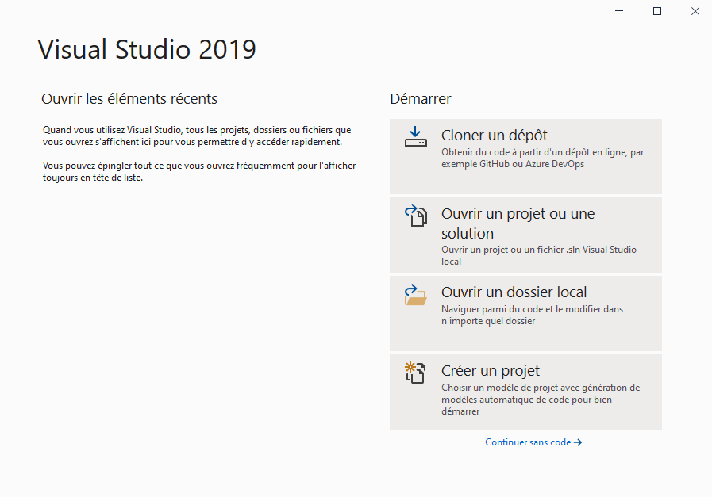
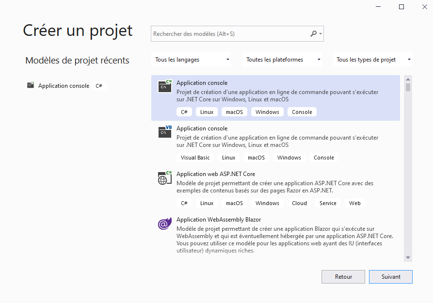
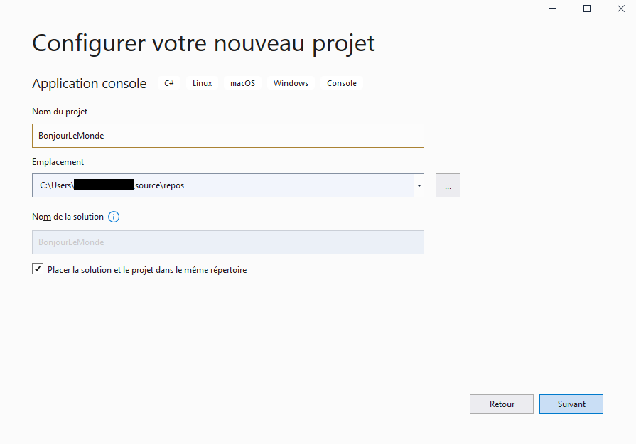
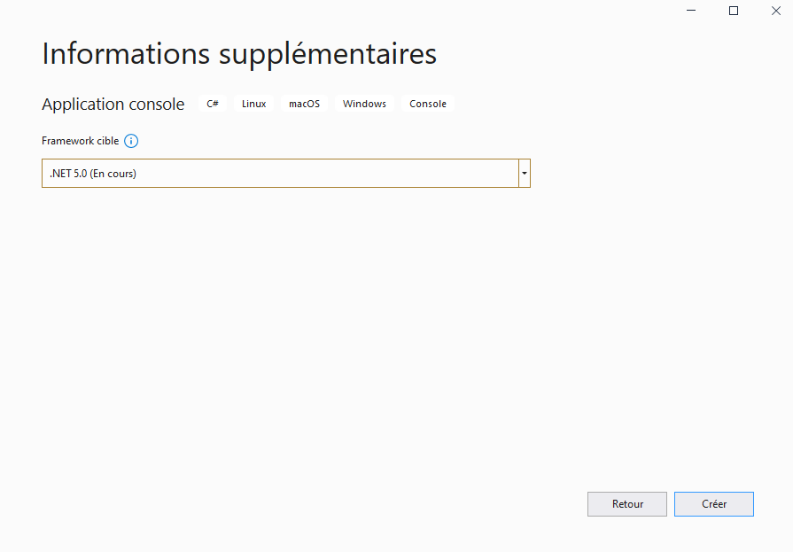
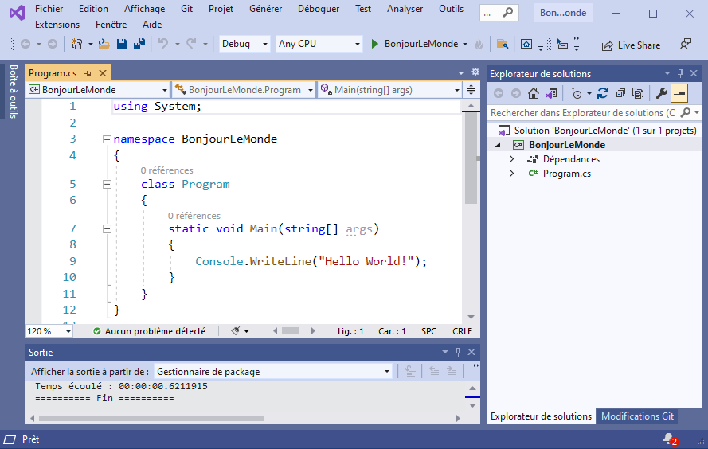
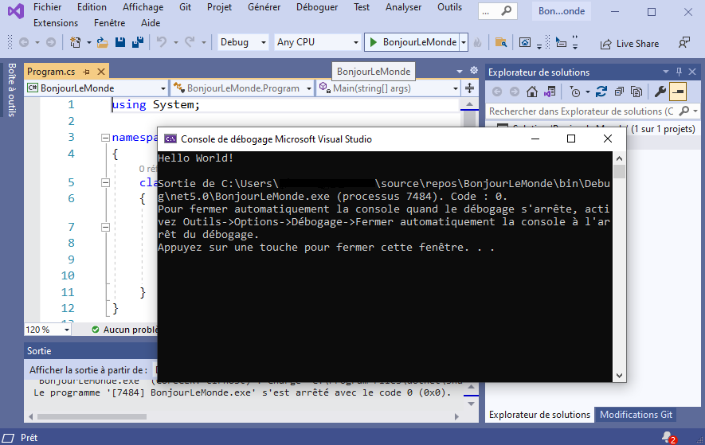
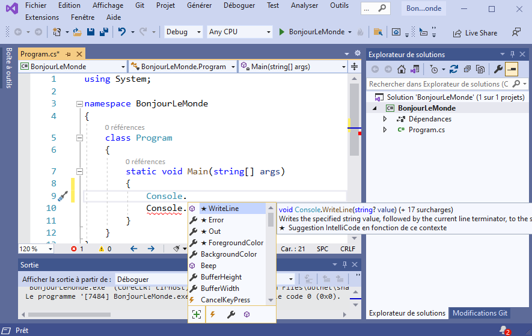
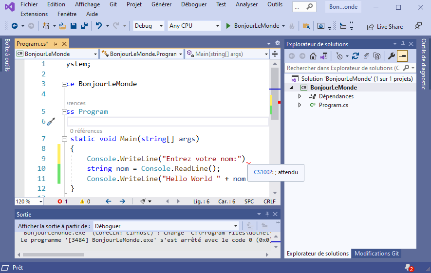

# Découvrir Visual Studio 2019

L'objectif de ce chapitre est de découvrir le logiciel de développement intégré Visual Studio.

## Introduction

### Qu'est ce qu'un IDE ?

Un IDE (Integrated Development Environment, AGL en Francais pour Atelier de Génie Logiciel) est étudié pour faciliter le développement de programmes. Pour cela, il propose de nombreuses fonctionnalités étendues, comme la gestion d'un projet, la compilation automatique, la gestion des liens, la gestion des dépendances, la gestion des erreurs, la gestion de la documentation, la gestion des tests unitaires, la gestion des bibliothèques, etc. Il ne font toutefois pas toujours l'unanimité.

> (...) Les développeurs sont des gens pointilleux. Comme un chien qui refuse de marcher sur de l'herbe mouillée, il y a toujours eu une certaine résistance à changer une routine. Nous aimons ce avec quoi nous avons grandi, que ce soit les blagues de Star Trek, Vim ou Emacs.

> Les origines de cette guerre remontent aux groupes Usenet des années 1980, une époque où Vi et Emacs étaient les principaux outils utilisés pour coder. Emacs, comme nous le savons bien, est un "labyrinthe de petits passages tortueux, tous différents" (une vieille blague de programmeur tirée du jeu Colossal Cave Adventure) tandis que Vim (et Vi avant lui) offre un univers de raccourcis clavier contrôlés par des flèches. Tous deux sont utilisés pour coder, éditer et administrer des systèmes. Et, bien que nous n'aimions pas le dire, les deux ont atteint un point où aucun d'entre eux ne semble vraiment vouloir s'éteindre au soleil couchant.

> La guerre sans fin entre les utilisateurs de Vim et d'Emacs s'est poursuivie ad nauseam au fil des ans. À ce stade, il s'agit moins d'une guerre que d'un grognement d'habitudes ancrées et d'une résistance obstinée au changement. Les utilisateurs de Vim et d'Emacs, autrefois à couteaux tirés, semblent avoir implémenté les raccourcis clavier de l'autre (une chose qu'ils font réellement) pour s'attaquer à un ennemi commun - tout IDE moderne (...)"

 John Biggs et Ryan Donovan , "The overflow", 2020

Un reproche courant fait a Visual Studio Code est de ne pas être assez intuitif. C’est vrai, mais c’est aussi un reproche que l’on peut faire à tous les autres IDE.

Les différences entre Visual Studio Code et Visual Studio sont étendues, mais elles sont surtout visibles dans les fonctionnalités de développement. Visual Studio Code est conçu pour être un outil de développement rapide, et il est donc conçu pour être utilisé avec des extensions. Visual Studio par contre était conçu pour être un outil de développement complet, et il est donc conçu pour être utilisé sans extensions.

### Notre premier programme pas à pas

Nous allons utiliser l'IDE Visual Studio pour créer un premier programme en mode console. Le mode console vous sera déja familier et nous allons rédiger ce programme avec le langage C#.



L'écran d'accueil de VS2019 permets de choisir entre plusieurs possibilités:

* **Cloner un dépôt** pour utiliser un code source dont les révisions sont convenablement suivies.
* **Ouvrir un projet ou une solution** pour ouvrir du code source local organisé dans un projet
* **Ouvrir un dossier local** pour ouvrir du code source simplement enregistré dans un dossier local
* **Créer un projet** créer un projet afin d'écrire notre programme

Nous choissisons donc **Créer un projet**.

Ensuite, l'écran suivant permet de choisir le type de projet que nous souhaitons créer.



En effet Visual Studio permet de créer des projets étendus, appelés solutions, qui regroupent plusieurs projets. Cela permet de gérer plus facilement les projets et leurs dépendances.Ces projets peuvent être de type console, de type .Net, de type WPF, de type application ASP .NET etc.

Nous choissisons donc **Application console C#**.

Ensuite, l'écran suivant permet de spécifier les premières propriétés de notre projet.



Ici nous choissirons comme Nom du projet le nom "BonjourLeMonde". En effet nous allons écrire une première application très simple qui se contentera d'afficher un message.

Ainsi, ensuite, l'écran suivant nous permet de choisir le framework que nous allons utiliser pour développer notre première application.



**DEFINITION** : Un framework logiciel est un ensemble cohérent de composants logiciels étendu par des modules. Le framework logiciel facilite le développement des applications.

Enfin, notre projet est crée et nous voyons un code source proposé par défaut s'afficher. Ce code fait ce qu'on attendait de lui, il propose une sortie texte dans la console.



Nous pouvons executer notre programme et ainsi en voir l'éxécution.




## Les fonctionnalités de l'IDE

### La complétion de code

Une fonctionnalité intéressante de notre IDE est la complétion de code. Cela signifie que l'IDE fait des proposition pour l'écriture du code.

Nous verrons plus tard sur quel mécanismes se base cette fonctionnalité. Dans l'immédiat vous pouvez tester en ajoutant une ligne qui débute par **Console** suivi de **.** et en laissant le menu déroulant s'afficher.

Dans ce menu déroulant l'éditeur vous propose un ensemble de possibilités relatives au contexte (ici les possibilités sont liées au fait que nous cherchons ce que Console nous permettra de faire).




### Erreurs de syntaxe

L'IDE permet également de donner des indices sur les erreurs de syntaxe. Généralement l'indice sur l'erreur propose même des solutions possibles (ci-dessous l'éditeur indique qu'un **;** est attendu).




### Modification de notre programme

Maintenant, complétez notre premier programme pour que nous soyons convenablement salués lors de l'éxécution.

```csharp
static void Main(string[] args)
{
    Console.WriteLine("Entrez votre nom:");
    string nom = Console.ReadLine();
    Console.WriteLine("Hello World " + nom + "!");
}
```
